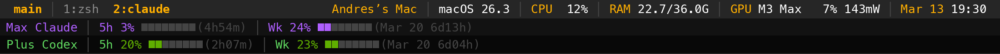

# claude-tmux

A tmux setup for AI-assisted development. Status bar with live system stats and rate limits for Claude Code and/or Codex — whatever you use.



Only use Claude? You get system stats + Claude limits. Only Codex? Same idea. Both? All three lines. The scripts gracefully show "no auth" if a service isn't configured — nothing breaks.

There's nothing to install. This repo is a reference — browse the scripts, see how the APIs work, and then tell Claude Code to build yours. Point it here in a session and describe what you want:

> *"Set up my tmux with a status bar showing Claude and Codex rate limits. Use this as a reference: https://github.com/affromero/claude-tmux"*

Claude reads the repo, reads your system, and writes a setup tailored to your machine — your terminal, your GPU, your subscriptions. The result is a [Claude Code skill](https://docs.anthropic.com/en/docs/claude-code) that lives in your `~/.claude/skills/` directory, fully yours to modify however you like. Change the colors, drop a status line, add a battery indicator, whatever.

Run `/setup-tmux` again anytime to update. Or just edit the files directly — they're just bash scripts and a tmux config.

### What gets created

1. `~/.tmux.conf` — full config (Claude shows a diff before overwriting)
2. `~/.tmux/scripts/sys-stats.sh` — system stats for the status bar
3. `~/.tmux/scripts/claude-limits.sh` — Claude Code rate limit monitor
4. `~/.tmux/scripts/codex-limits.sh` — Codex rate limit monitor
5. TPM + plugins (tmux-resurrect, tmux-continuum)
6. Terminal Meta key config (Ghostty/iTerm2/VS Code/Cursor)
7. Claude Code agent teams enabled

### Prerequisites

- tmux 3.4+ (for multi-line status bar)
- `python3` and `curl` (for the limit scripts)
- Claude Code logged in, Codex CLI logged in, or both — each limit line works independently

## Features

### 3-Line Status Bar

| Line | Content | Update interval |
|------|---------|-----------------|
| **0** | Session name, window tabs, system stats, date/time | 5s |
| **1** | Claude Code usage: 5h window + weekly, with progress bars | 5min (cached) |
| **2** | Codex usage: 5h window + weekly + credits, with progress bars | 60s (cached) |

### System Stats (Line 0)

Cross-platform script showing live hardware metrics:

| Stat | macOS | Linux | Windows (MSYS) |
|------|-------|-------|----------------|
| CPU usage | `top -l 2` | `/proc/stat` | `wmic` |
| RAM | `vm_stat` | `/proc/meminfo` | PowerShell |
| GPU name | `sysctl` | `nvidia-smi` / sysfs / `lspci` | `nvidia-smi.exe` |
| GPU usage | `powermetrics` | `nvidia-smi` / AMD sysfs / `intel_gpu_top` | `nvidia-smi.exe` |
| GPU power | `powermetrics` (mW) | `nvidia-smi` (W) / AMD hwmon | `nvidia-smi.exe` |

On Apple Silicon, GPU stats require a one-time sudoers entry for `powermetrics` (the skill sets this up). Everything else works unprivileged.

### Claude Code Limits (Line 1)

```
Max Claude │ 5h 3% ░░░░░░░░ (4h54m) │ Wk 24% █░░░░░░░ (Mar 20 6d13h)
```

- **How it works:** Sends a minimal 1-token Haiku request to `/v1/messages` and reads the `anthropic-ratelimit-unified-*` response headers. The `/api/oauth/usage` endpoint is [effectively disabled](https://github.com/anthropics/claude-code/issues/30930) — this is the same technique used by [Claude Usage Tracker](https://github.com/hamed-elfayome/Claude-Usage-Tracker).
- **Cost:** ~1 input token + 1 output token of Haiku per refresh. Negligible.
- **Cache:** 5 minutes (each refresh is a real API call)
- **Auth:** Reads OAuth token from macOS Keychain (`Claude Code-credentials`) or `~/.claude/.credentials.json`
- **Colors:** Purple (Claude brand) when healthy, amber at 50%+ used, red at 80%+ used
- **Shows:** Subscription tier, 5h used% + bar + time remaining, weekly used% + bar + reset date/countdown

### Codex Limits (Line 2)

```
Plus Codex │ 5h 20% █░░░░░░░ (2h07m) │ Wk 23% █░░░░░░░ (Mar 20 6d04h)
```

- **How it works:** Queries `chatgpt.com/backend-api/wham/usage` with bearer token from `~/.codex/auth.json`
- **Cache:** 60 seconds
- **Auth:** Reads `tokens.access_token` from `~/.codex/auth.json` (created by `codex login`)
- **Colors:** Green (Codex brand) when healthy, amber at 50%+ used, red at 80%+ used
- **Shows:** Plan tier + "Codex" label, 5h used% + bar + time remaining, weekly used% + bar + reset date/countdown, credits (if applicable)

### Keybindings

| Shortcut | Action |
|----------|--------|
| `Ctrl+b \|` | Split horizontal |
| `Ctrl+b -` | Split vertical |
| `Ctrl+b arrow` | Switch panes |
| `Alt+arrow` | Switch panes (no prefix) |
| `Ctrl+b Shift+W/A/S/D` | Resize panes (5 cells, repeatable) |
| `Ctrl+b T` | Rename pane title |
| `Ctrl+b s` | Session tree picker |
| Mouse scroll | Scroll history (2 lines/tick) |
| Mouse drag | Select text (auto-copy) |
| Right-click | Exit copy mode |
| `v` / `y` (copy mode) | Begin selection / yank |

### Pane Naming for AI Agents

Each pane shows a label in its top border (`session:pane command`). You can set custom names with `Ctrl+b T`:

```
┌─ dev:1 claude ──────────────────┐┌─ dev:2 tests ──────────────────┐
│ claude> implementing auth flow  ││ npm run test:watch             │
│                                 ││ PASS src/auth.test.ts          │
└─────────────────────────────────┘└─────────────────────────────────┘
┌─ dev:3 server ──────────────────────────────────────────────────────┐
│ [nodemon] watching for changes...                                   │
└─────────────────────────────────────────────────────────────────────┘
```

This matters because AI agents work in tmux but have no visual context — they can't see which pane is which. Without names, an agent has to guess by index or run `tmux list-panes` and parse the output to figure out what's running where. With named panes:

- An orchestrator agent can say "check the `tests` pane for failures" or "send the build command to the `server` pane" — no index arithmetic, no guessing
- When Claude Code spawns teammates via agent teams, each gets a named pane so the main agent knows exactly where each teammate is working
- You can name panes by function (`build`, `logs`, `db`, `api`) rather than relying on whatever command happens to be running — the name persists even if you restart the process
- `tmux list-panes -F '#{pane_title}'` gives agents a semantic map of the workspace in one command

### Visual Design

- **Dark theme** with amber active pane borders, dim inactive panes
- **Pane labels** in top border showing `session:pane command`
- **Active pane** has bright white text; inactive panes dim to grey
- **Window tabs** with gold highlight on current window
- **SSH detection** — prefixes `[SSH]` to session name and terminal title when remote
- **Ghostty/iTerm2/VS Code** terminal title integration (`session:window`)

### Session Persistence

- **tmux-resurrect** saves pane layouts, working directories, and running commands
- **tmux-continuum** auto-saves every 15 minutes and restores on server start
- Survive reboots, crashes, and SSH disconnects

### Clipboard

- **OSC 52** for remote clipboard (copy from SSH tmux to local clipboard)
- **vi copy mode** with `v` to select, `y` to yank
- **Mouse drag** auto-copies selection
- Works across Ghostty, iTerm2, VS Code, and most modern terminals

### Agent Teams

The skill enables `CLAUDE_CODE_EXPERIMENTAL_AGENT_TEAMS` so Claude Code can spawn parallel teammates in tmux panes. Combined with pane naming, this gives you a multi-agent workspace where each teammate has a named, addressable pane.

## How the AI Limit APIs Work

Both APIs are undocumented and reverse-engineered. They may change without notice.

### Claude: Messages API Rate Limit Headers

The dedicated usage endpoint (`/api/oauth/usage`) returns persistent 429 errors. Instead, we send a throwaway Haiku request and read the response headers:

```
anthropic-ratelimit-unified-5h-utilization: 0.03    # 0.0-1.0
anthropic-ratelimit-unified-5h-reset: 1773446400    # Unix timestamp
anthropic-ratelimit-unified-7d-utilization: 0.24
anthropic-ratelimit-unified-7d-reset: 1773997200
```

Required headers for OAuth authentication:
```
Authorization: Bearer <token>
User-Agent: claude-code/2.1.5
anthropic-beta: oauth-2025-04-20
anthropic-version: 2023-06-01
```

### Codex: WHAM Usage API

```bash
curl -H "Authorization: Bearer <token>" \
  "https://chatgpt.com/backend-api/wham/usage"
```

Returns `rate_limit.primary_window` (5h), `rate_limit.secondary_window` (weekly), `credits`, `plan_type`, and `limit_reached`.

Token lives in `~/.codex/auth.json` → `tokens.access_token`.

## Why Not a Plugin?

Traditional tmux plugins (TPM) install scripts and set options. They can't detect your terminal, configure Meta keys, set up GPU monitoring, or adapt to SSH vs local. A Claude Code skill does all of that conversationally — it reads your machine and asks when it's unsure.

More importantly: you're not locked into someone else's config. The skill generates files that are entirely yours. Edit them, fork the approach, ask Claude to rewrite the whole thing in a different style. There's no upstream to stay in sync with.

## Prior Art

Several tools show AI rate limits in tmux, but none combine Claude + Codex + system stats in a single setup:

- [tmux-claude-live](https://github.com/worldnine/tmux-claude-live) — tmux daemon for Claude 5h block usage via ccusage
- [claude-code-usage-bar](https://github.com/leeguooooo/claude-code-usage-bar) — `#(claude-statusbar)` pip package for tmux
- [simoninglis/claude-usage](https://gist.github.com/simoninglis/b6f909ba0aa2f67af872866e2f22dbd4) — bash script for tmux status-right, 5h + 7d quotas
- [tmux-agent-indicator](https://github.com/accessd/tmux-agent-indicator) — TPM plugin for agent state (running/done), not rate limits
- [CodexBar](https://github.com/steipete/CodexBar) by Peter Steinberger — macOS menu bar for Codex/Claude/Cursor limits
- [Claude Usage Tracker](https://github.com/hamed-elfayome/Claude-Usage-Tracker) by Hamed Elfayome — macOS menu bar, discovered the Messages API header technique we use
- [ccusage](https://github.com/ryoppippi/ccusage) — CLI data engine for Claude token stats from local JSONL files

## License

MIT
